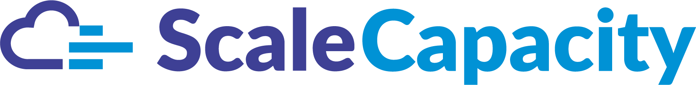

# Summer Internship 2024 - D22IT184

Welcome to my Summer Internship 2024 repository! This repository contains all the work and projects I completed during my internship at **ScaleCapacity**.

## Table of Contents

- [Introduction](#introduction)
- [Projects](#projects)
- [Technologies Used](#technologies-used)

## Introduction

This repository documents the progress and outcomes of my summer internship in 2024 at [ScaleCapacity](https://www.scalecapacity.com/). My roll number is **D22IT184**. Throughout this internship, I engaged in various tasks to enhance my skills and contribute to meaningful work.

## Projects

### Project 1: KEMS ( KnightScope Emergency Management System )
- **Objective:** To manage all emergency devices and their functionalities.
- **Technologies Used:** HTML, CSS, JS, PostgreSQL, jQuery.
- **Status:** Currently in progress, with ongoing tasks and updates being handled as instructed by my senior colleague.
- **Description:** The KEMS (Knight Scope Emergency System) project at ScaleCapacity focuses on enhancing emergency response through the deployment of callboxes worldwide. A callbox is a device used by individuals to report accidents or emergencies, ensuring swift assistance. The project involves mapping callbox locations, monitoring their status, integrating cameras, and generating comprehensive reports, such as monthly active callbox reports and system availability history. An admin panel is also developed to manage these callboxes efficiently. My role includes completing tasks and implementing changes as directed by my senior colleague.

## Technologies Used

- Programming Languages: HTML, CSS, JavaScript
- Frameworks: Bootstrap, jQuery, Sequelize
- Tools: VScode, Git
- Platforms: PostgreSQL, AWS

## Start Of Internship 

### 1️⃣ Week 1
- **Induction :** My internship at ScaleCapacity began with an induction meeting where Maulik Sir provided a brief overview of the company. During this meeting, I, along with other selected students, introduced ourselves. Maulik Sir also shared essential information and guidelines necessary for our successful integration into the company. This initial session set the foundation for the work and collaboration that would follow in the subsequent weeks.

- **Setup & Installation :** 
    - Following the induction, I received an AWS account from the company and logged in. I then cloned the project repository from AWS. To set up my development environment, I installed 
    - XAMPP, 
    - PostgreSQL  
    - pgAdmin. 

    - This setup was crucial for managing and interacting with the database and running the local development server.